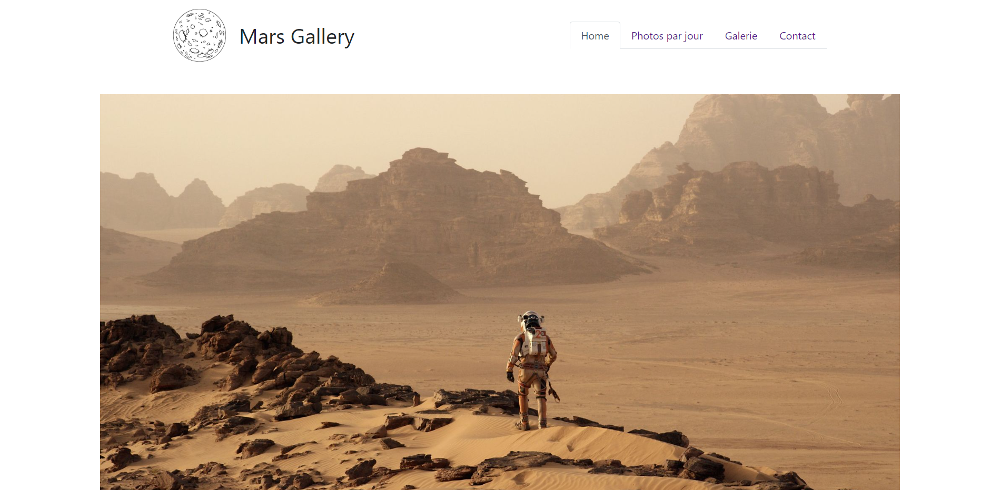

    <h1><b>Mars gallery</b></h1>
    <h4>
        Training project (work in progress)
    </h4>

 
    

## Table of contents

- [Table of contents](#table-of-contents)
- [About the project](#about-the-project)
- [Built with](#built-with)
- [Credits](#credits)

## About the project

 
  Mars Gallery is a training project built during my final degree year.

## Built with

Frontend  

## Credits

Diane M.

